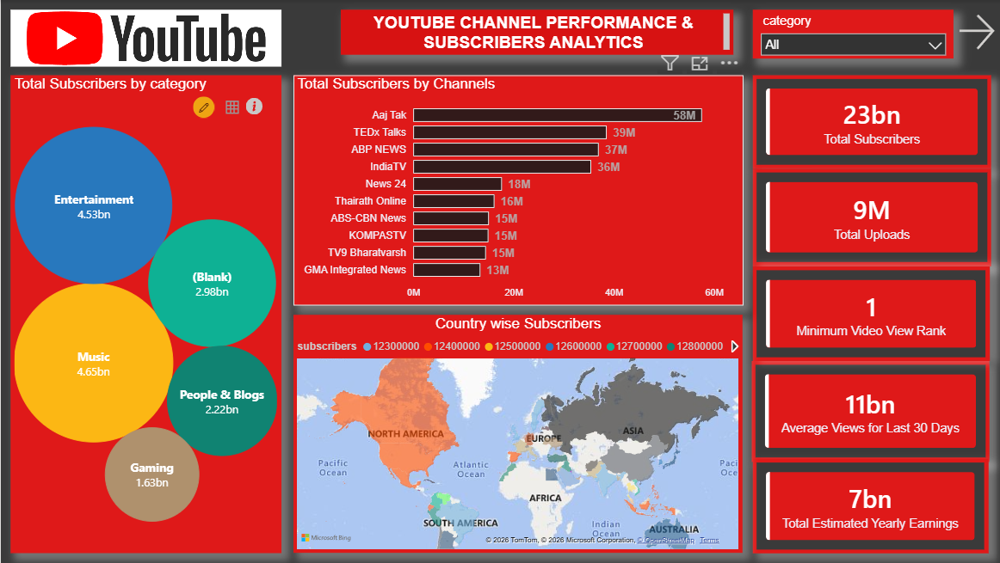
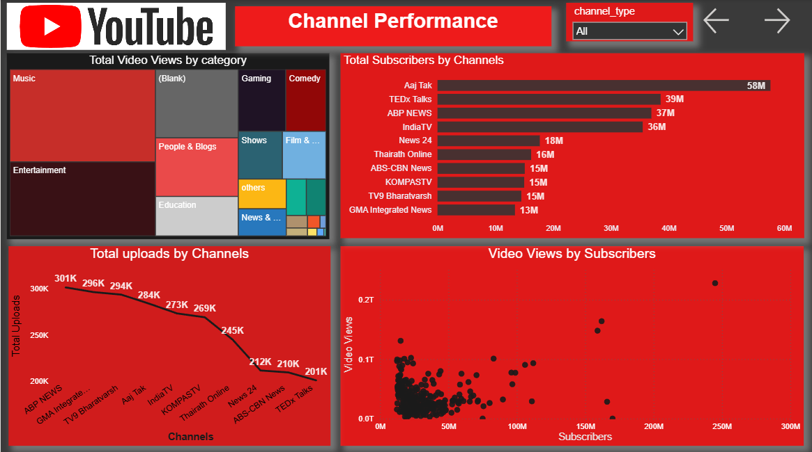
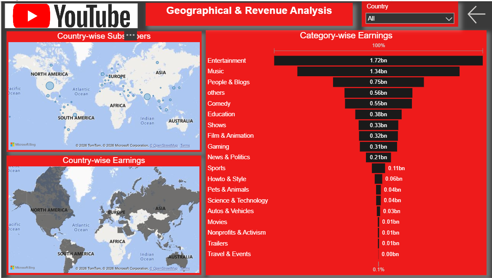

# YouTube Channel Performance & Analytics | SQL + Power BI

## Project Overview

This project analyzes YouTube channel performance using SQL and
Power BI.
The objective is to analyze subscribers, video uploads, video views,
content categories, geographical performance, and estimated earnings.
SQL was used for data exploration, data preparation, aggregation,
and analytical queries, while Power BI was used to build an
interactive dashboard and visualize the results.
---
## Business Objectives

The project focuses on answering the following questions:
- Which YouTube channels have the highest number of subscribers?
- Which categories have the highest subscribers?
- Which channels have the highest number of uploads?
- How do video views vary with subscribers?
- Which countries have higher subscriber performance?
- Which countries contribute to estimated earnings?
- Which content categories generate the highest earnings?
- Which channels and categories show stronger overall performance?

---
## SQL Analysis
SQL was used to perform data exploration and analytical operations
before visualization.

### Data Validation & Cleaning
1.Find the total number of records available in the dataset.
2.Check whether duplicate channel names exist.
3.Identify all columns containing Null Values.
4.Replace Null values wherever appropriate.
5.Verify and correct the data types of all numeric and date columns.

### SQL Tasks
1.Display the Top 10 Youtube channels based on Subscribers.

2.Find the Top 5 countries having the highest total subscribers.

3.Display the Top 10 Categories based on total Video Views.

4.Find the channel having the Highest subscribers gain in last 30 Days.

5.Calculate the average yearly earnings for each youtube category.

6.Create a SQL View named vw_ChannelPerformance containing the following columns:

 -Channel Name

 -Country
 
 -Category
 
 -Subscribers
 
 -Video views
 
 -Uploads
 
 -Highest Yearly Earnings

SQL scripts are available in the  `SQL` folder.

---
## Power BI Dashboard
The cleaned and analyzed data was visualized using Power BI.
The dashboard contains three main pages.

---
## 1. Executive Dashboard
The Executive Dashboard provides a high-level overview of
YouTube channel performance.

### KPIs
- Total Subscribers
- Total Uploads
- Minimum Video View Rank
- Average Views for Last 30 Days
- Total Estimated Yearly Earnings

### Visualizations
- Total Subscribers by Category
- Total Subscribers by Channel
- Country-wise Subscribers

Click any dashboard image below to view it in full size.
 [](Dashboard-screenshots/ExecutiveDashboard.png)

---
## 2. Channel Performance
This page focuses on channel-level performance.
### Analysis
- Total Video Views by Category
- Total Subscribers by Channel
- Total Uploads by Channel
- Video Views vs. Subscribers
This page helps compare channels based on subscribers,
uploads and video views.

Click any dashboard image below to view it in full size.
 [](Dashboard-screenshots/ChannelPerformance.png)

---
## 3. Geographical & Revenue Analysis
This page focuses on geographical and revenue performance.
### Analysis
- Country-wise Subscribers
- Country-wise Earnings
- Category-wise Earnings

This helps identify geographical markets and content categories
with stronger revenue and subscriber performance.

Click any dashboard image below to view it in full size.
 [](Dashboard-screenshots/Geographic&Revenue.png)

---
## Key Insights
Based on the dashboard analysis:
- Entertainment and Music are major categories in terms of
  subscribers and estimated earnings.
- Aaj Tak has the highest subscriber count among the displayed
  channels.
- Several leading channels have subscriber counts in the
  tens of millions.
- Entertainment contributes the highest category-wise
  estimated earnings.
- Music is another major contributor to subscribers and earnings.
- Channel performance varies significantly when comparing
  subscribers, uploads and video views.
- YouTube performance is distributed across multiple countries
  and geographical regions.

---
## SQL + Power BI Workflow
The overall project workflow was:
```text
Raw Dataset
     ↓
SQL Data Exploration
     ↓
SQL Data Cleaning & Transformation
     ↓
SQL Analytical Queries
     ↓
Power BI Data Modeling
     ↓
DAX Measures
     ↓
Interactive Dashboard
     ↓
Business Insights
